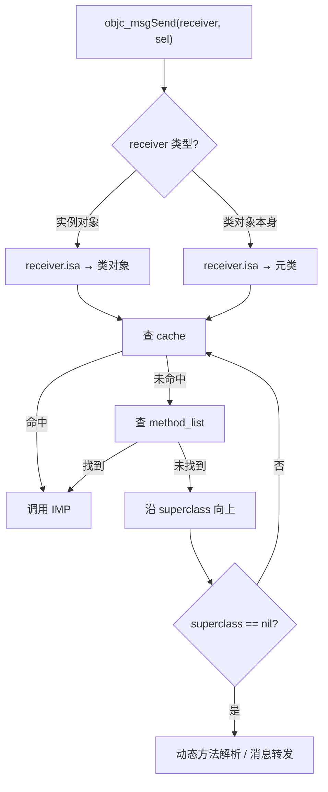

+++
date = '2026-06-28T19:13:28+08:00'
draft = true
title = '第一章：isa 与 superclass'
tags = ["Objective-C", "Runtime", "面试"]
categories = ['iOS 面试']
+++

# 第一章：isa 与 superclass

## 1.1 核心概念

在 Objective-C 中，**每个对象本质上是一块内存 + 一个指向类信息的 `isa` 指针**。

```
实例对象 (instance)
├── isa  ──────────► 类对象 (class)
│                      ├── isa ──► 元类 (metaclass)
│                      ├── superclass ──► 父类
│                      └── 方法列表 / 属性 / 协议 ...
└── 成员变量 ivars
```

| 层级 | isa 指向 | superclass 作用 |
|------|----------|----------------|
| **实例对象** | 类对象 (class) | 无 |
| **类对象** | 元类 (metaclass) | 父类（继承方法实现） |
| **元类** | 根元类（NSObject 的 metaclass） | 父元类（继承类方法） |

**记忆口诀**：实例找类，类找元类；实例方法在类里，类方法在元类里。

---

## 1.2 isa 指针的演进

| 平台 | 特点 |
|------|------|
| **32 位** | `isa` 就是纯指针 |
| **64 位（Non-pointer isa）** | `isa` 不再只是地址，低位 bit 复用存储 **retain count、是否 weak、是否 deallocating** 等标志 |

### 演进脉络（32 位 → 64 位）

可以这么理解，但面试表述建议更精确：

```
32 位时代
  isa = 纯 Class 指针（每一位都是地址）
  引用计数、weak 表 ──► 几乎都要靠 Side Table（带锁）

64 位时代（指针本身 64 bit，地址空间用不满）
  发现 Class 指针低 3 位恒为 0、高位也有冗余
  ──► 把 retain count、标志位「塞进」isa（non-pointer isa / extra_rc）
  ──► 常见对象的 retain/release 走无锁 fast path

Side Table 没有废弃
  ──► weak 管理、计数溢出、RC_HALF 半迁 ──► 仍是刚需
```

| | 32 位 | 64 位 arm64 |
|--|-------|-------------|
| isa 角色 | 只存 Class 地址 | Class + 标志位 + **19 bit 引用计数** |
| 强引用计数主路径 | Side Table 为主 | **extra_rc 为主**，Side Table 兜底 |
| Side Table | 从一开始就需要 | **保留**，职责变「备用 + weak 专用」 |
| 「宽裕」程度 | 32 bit 全是指针，无冗余可榨 | arm64 较宽裕；x86_64 仅 8 bit extra_rc，宽裕有限 |

**一句话**：Side Table 确实是 **32 位时代就有的老设计**；64 位 non-pointer isa 是 **利用地址位冗余做的性能优化**，让大多数对象不必碰 Side Table——但 weak 和溢出场景仍离不开它，不是简单「64 位替代了 Side Table」。

**Non-pointer isa 好处**：减少内存占用、提升 retain/release 性能（引用计数优先改 `isa` 里的 `extra_rc`，不必每次访问 Side Table）。

> 以下位域以 **arm64（真机 iPhone / iPad）** 为准，数据来自 Apple objc4 源码 `objc-private.h`。Mac / 模拟器的 **x86_64** 布局不同，面试说清 arm64 即可。

### 1.2.1 arm64 位域布局（64 bit 从低到高）

C 语言 bitfield **第一个字段占最低位（LSB）**，`extra_rc` 故意放在最高位，方便 retain/release 用进位标志做 `+1 / -1`。

```
 63 ─────────────────────────────── 45 44 43 42 41 ─── 36 35 ───────────── 3  2  1  0
├──────── extra_rc（19 bit）────────┤│││││ magic（6）││ shiftcls（33 bit）  ││││
                                   sidetable  dealloc  weak
```

| 位段 | 字段 | 位数 | 含义 |
|------|------|------|------|
| bit 0 | `nonpointer`（源码名 `indexed`） | 1 | `1` = 优化 isa，走 bitfield；`0` = 普通指针 |
| bit 1 | `has_assoc` | 1 | 是否有关联对象（Associated Objects） |
| bit 2 | `has_cxx_dtor` | 1 | 是否有 C++ 析构函数 |
| bit 3 ~ 35 | `shiftcls` | 33 | **类地址右移 3 位** 后存入（类 8 字节对齐，低 3 位恒为 0） |
| bit 36 ~ 41 | `magic` | 6 | 魔数，校验 isa 是否合法 / 对象是否初始化完成 |
| bit 42 | `weakly_referenced` | 1 | 是否被 weak 引用过 |
| bit 43 | `deallocating` | 1 | 是否正在 dealloc |
| bit 44 | `has_sidetable_rc` | 1 | `1` = 部分引用计数在 Side Table |
| bit 45 ~ 63 | `extra_rc` | 19 | **引用计数 - 1**（实际 retain count = extra_rc + 1，直到溢出） |

**为什么 `shiftcls` 要右移 3 位？**

类对象地址 8 字节对齐，地址低 3 位永远是 `000`。Runtime 把有效地址位「挤」进 33 个 bit，取出时再 `& ISA_MASK` 还原成对齐后的类指针。

```objc
// 取类指针（简化理解）
Class cls = (Class)(isa.bits & ISA_MASK);
```

### 1.2.2 核心 Mask 值（arm64）

| 宏 | 值 | 作用 |
|----|-----|------|
| `ISA_MASK` | `0x0000000ffffffff8ULL` | 掩出 **shiftcls 区域**，得到类指针（低 3 位补 0） |
| `ISA_MAGIC_MASK` | `0x000003f000000001ULL` | 掩出 **nonpointer + magic** 位 |
| `ISA_MAGIC_VALUE` | `0x000001a000000001ULL` | 合法 non-pointer isa 的 magic 期望值 |
| `RC_ONE` | `1ULL << 45` | retain +1：整型 `isa + RC_ONE` 等价于 `extra_rc + 1` |
| `RC_HALF` | `1ULL << 18` | `extra_rc` 的一半边界；溢出时一半计数迁到 Side Table |

**`ISA_MASK` 二进制直观理解**：

```
0x0000000ffffffff8
= ...0000 0000 1111 1111 1111 1111 1111 1111 1111 1000
                              └──── shiftcls 33 bit ────┘└低3位0┘
  & isa  →  抹掉 meta 标志位，留下「对齐后的 Class 地址」
```

**`ISA_MAGIC_VALUE` 的作用**：

- bit 0 必须为 `1`（non-pointer isa）
- bit 36~41 的 magic 必须为 `0x1A`
- Runtime 调试 / 校验时用 `(isa & ISA_MAGIC_MASK) == ISA_MAGIC_VALUE` 判断对象 isa 是否有效

### 1.2.3 引用计数与 Side Table 的配合

**面试追问：extra_rc 能存约 52 万次 retain，为什么还要 Side Table？**

`extra_rc` 解决的是**大多数对象的性能问题**（无锁 fast path），Side Table 解决的是 **extra_rc 解决不了的事**：

| 原因 | 说明 |
|------|------|
| **① weak 引用必须走 Side Table** | `extra_rc` 只能存强引用计数，**存不了 weak 指针表**。对象一旦被 `__weak` 引用，Runtime 要在 Side Table 的 **weak 哈希表** 里登记，`isa.weakly_referenced = 1` |
| **② extra_rc 会溢出** | 19 bit 上限约 **2^19 ≈ 52 万**。极端场景（循环 retain、压力测试、长生命周期全局缓存）仍可能超出 |
| **③ 半迁策略（RC_HALF）** | 溢出前不是等填满再迁，而是 **一半计数搬进 Side Table，一半留在 extra_rc**。后续 release 先减 `extra_rc`，减到 0 才去 Side Table 拿锁——**减少锁竞争** |
| **④ 架构差异** | x86_64 的 `extra_rc` 只有 **8 bit**（约 255 次），更早依赖 Side Table |
| **⑤ 历史演进** | Side Table 早于 non-pointer isa 存在；weak、溢出、dealloc 协调仍依赖它，没有被删掉 |

```
                    ┌─────────────────────────────────────┐
  普通强引用对象     │  仅 extra_rc，无锁 retain/release   │  ← 绝大多数对象
                    └─────────────────────────────────────┘

                    ┌─────────────────────────────────────┐
  被 weak 过的对象   │  isa.weakly_referenced = 1          │
                    │  + Side Table 维护 weak 指针表       │  ← weak 无法用 isa 替代
                    └─────────────────────────────────────┘

                    ┌─────────────────────────────────────┐
  引用计数极高       │  has_sidetable_rc = 1               │
                    │  extra_rc 存一半 + Side Table 存一半 │  ← 溢出 + 性能折中
                    └─────────────────────────────────────┘
```

**流程简图**：

```
retain/release 优先操作 extra_rc（isa 高 19 位，无锁）
        │
        ├─ 对象从未 weak ──► 计数低 ──► 始终只用 extra_rc ✅
        │
        ├─ 出现 __weak 引用 ──► Side Table 登记 weak 表（与 extra_rc 并行存在）
        │
        └─ extra_rc 即将溢出 ──► RC_HALF：一半迁入 Side Table，has_sidetable_rc = 1
                                      └── 继续 retain 需对 Side Table 加锁
```

**一句话总结（背这个）**：

> **extra_rc 是「快车道」，Side Table 是「备用车道 + weak 专用仓库」**——快道够用时不用表；weak 必须用表；计数爆满或需要分摊锁竞争时也要用表。

- **extra_rc 最大** ≈ 2^19 - 1，即单 isa 可表示约 **52 万次** retain
- **weakly_referenced = 1** 时，dealloc 需清理 Side Table 中的 weak 表
- **deallocating = 1** 时，防止 dealloc 过程中再次 retain 导致崩溃

### 1.2.4 x86_64 对比（了解即可）

| 字段 | arm64 | x86_64（Intel Mac / 旧模拟器） |
|------|-------|--------------------------------|
| `shiftcls` | 33 bit | 44 bit |
| `extra_rc` | 19 bit | 8 bit |
| `ISA_MASK` | `0x0000000ffffffff8` | `0x00007ffffffffff8` |

架构不同，**Mask 和位宽不能混用**。

### 1.2.5 arm64e 补充（Pointer Authentication）

Apple Silicon 的 **arm64e** 设备上，类信息可能打包进 `shiftcls_and_sig`（52 bit），并配合 **指针认证（PAC）** 防篡改。面试一般问到 non-pointer isa 位域即可；若追问安全，可提 arm64e 会用 `ptrauth` 验证 Class 指针。

### 关联知识点

- **Tagged Pointer**：小对象（如 `@1`、`@YES`、短 NSString）不分配堆内存，数据直接编码在指针里，`isa` 指向特殊 tagged class
- **Side Table（散列表）**：当 retain count 过大或对象被 weak 引用时，额外信息存到 side table
- **weak 表**：`objc_storeWeak` 维护 weak 指针与对象的映射，对象 dealloc 时置 nil

---

## 1.3 isa 方法查找原理图

以 `Person : NSObject` 为例，**实例方法查「类链」，类方法查「元类链」**——这是面试里最常见的那张图。

### 关系全图（isa 链 + superclass 链）

```
                        isa 方向 ──────────────────────────────────────────►

  ┌──────────────┐  isa   ┌──────────────┐  isa   ┌──────────────┐
  │   实例对象    │ ─────► │    类对象     │ ─────► │     元类      │
  │ Person 实例  │        │ Person.class │        │ Person.meta  │
  └──────────────┘        └──────┬───────┘        └──────┬───────┘
                                 │                       │
                                 │ superclass            │ superclass
                                 ▼                       ▼
                          ┌──────────────┐        ┌──────────────┐
                          │  NSObject类  │        │ NSObject元类 │
                          └──────────────┘        └──────┬───────┘
                                                         │ superclass
                                                         ▼
                                                  ┌──────────────┐
                                                  │ NSObject元类 │  ← 根元类，指向自己
                                                  └──────────────┘

  实例方法存放处 ──►  类对象的方法列表（- 开头）
  类方法存放处   ──►  元类的方法列表（+ 开头）
```

### 实例方法查找（`[person eat]`）

```
Person 实例
    │  obj.isa
    ▼
Person 类 ──► cache 命中? ──是──► 调用 IMP
    │              │
    │              └── 否 → 查 method_list
    │  未找到
    ▼ superclass
NSObject 类 ──► cache / method_list
    │  未找到
    ▼
  nil ──► 动态方法解析 → 消息转发
```

### 类方法查找（`[Person run]`）

```
Person 类（接收者是 Class 本身）
    │  Person.class.isa（注意：走元类，不是类本身）
    ▼
Person 元类 ──► cache 命中? ──是──► 调用 IMP
    │              │
    │              └── 否 → 查 method_list
    │  未找到
    ▼ superclass
NSObject 元类 ──► cache / method_list
    │  未找到
    ▼
  nil ──► 动态方法解析 → 消息转发
```

### 查找流程总览（Mermaid）



**背诵要点**：

| 调用方式 | 起点 | 沿什么链查找 |
|----------|------|--------------|
| `[person eat]` 实例方法 | `person.isa` → **Person 类** | 类的 **superclass** 链 |
| `[Person run]` 类方法 | `Person.isa` → **Person 元类** | 元类的 **superclass** 链 |
| 任意一步 | 先 **cache**，再 **method_list** | 命中后写入 cache，下次更快 |

---

## 1.4 superclass 与继承链

方法查找顺序（**先 isa 定起点，再 superclass 向上，直到 nil**）：

```
[obj instanceMethod]
  → obj.isa 的 cache / method_list 查找
  → 未找到 → superclass 的 cache / method_list
  → 继续向上直到 nil
  → 仍未找到 → 动态消息转发

[Class classMethod]
  → Class.isa（元类）的 cache / method_list 查找
  → 未找到 → 元类.superclass 向上
  → 仍未找到 → 动态消息转发
```

### 关联知识点

| 知识点 | 说明 |
|--------|------|
| **Category 方法** | 运行时合并到类的方法列表，与主类方法同级；同名方法 **Category 后编译的覆盖先编译的** |
| **+load** | 类/Category 加载进 Runtime 时调用，**父类 → 子类 → Category**，不能继承、不能触发懒加载 |
| **+initialize** | 类**第一次收到消息**时调用，**父类 → 子类**，可继承（子类未实现则走父类） |
| **KVO** | 动态创建 **NSKVONotifying_xxx 子类**，修改 `isa` 指向子类，重写 setter 触发 KVO 回调 |
| **Method Swizzling** | 交换方法 IMP，本质改的是 **类/元类的方法列表**，所有实例共享 |

---

## 1.5 类结构（objc_class / objc_object）

```objc
// 简化理解
struct objc_object {
    Class isa;
};

struct objc_class {
    Class isa;              // 元类
    Class superclass;
    cache_t cache;          // 方法缓存
    class_data_bits_t bits; // 方法列表、属性、协议等
};
```

**方法缓存（cache_t）**：第一次慢速查找后，IMP 写入 cache，后续 `objc_msgSend` 走缓存，**O(1) 级别**。
