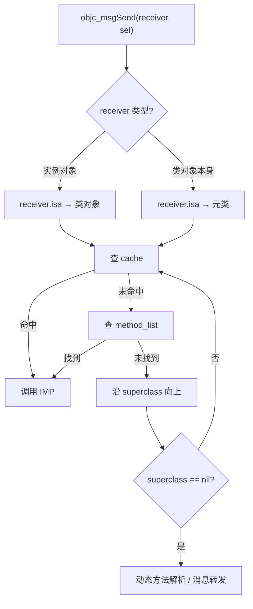

+++
date = '2026-06-28T19:13:28+08:00'
draft = true
weight = 1
title = '第一章：isa 与 superclass'
tags = ["Objective-C", "Runtime", "面试"]
categories = ['iOS 面试']
+++

# 第一章：isa 与 superclass

## 1.0 进程内存布局：栈 / 堆 / 代码区 / 常量区（基础）

> Block、对象、局部变量面试都会用到。先建立 **「谁在哪、谁管生命周期」** 的地图。

### 典型分区（逻辑视图）

```
高地址
┌─────────────────────────────────┐
│  栈 Stack                        │  局部变量、函数调用帧、参数
│  ↓ 向下增长                       │  自动分配/释放，线程私有
├─────────────────────────────────┤
│         （空闲 / 映射区）          │
├─────────────────────────────────┤
│  堆 Heap                         │  malloc / new / OC 对象 / Block(堆)
│  ↑ 向上增长                       │  手动或 ARC 管理，多线程共享
├─────────────────────────────────┤
│  BSS 段                          │  未初始化的全局/静态变量（启动时清零）
├─────────────────────────────────┤
│  已初始化数据段 .data             │  有初始值的全局/静态变量
├─────────────────────────────────┤
│  常量区 / 只读数据段 .rodata       │  字符串字面量、const 常量
├─────────────────────────────────┤
│  代码区 / 文本段 .text             │  编译后的机器指令，只读可执行
低地址
```

> 具体地址顺序因 OS/架构/ASLR 而异，面试记 **职责** 即可，不必背绝对地址。

### 各区域说明

| 区域 | 存什么 | 谁分配/释放 | 特点 |
|------|--------|-------------|------|
| **栈 Stack** | 函数 **局部 auto 变量**、参数、返回地址 | 编译器插入 prologue/epilogue，**出了作用域自动回收** | **LIFO**；默认几 MB，过大数组会栈溢出 |
| **堆 Heap** | `malloc`、**OC/Swift 对象**、**copy 后的 Block** | `free` / **ARC**（引用计数为 0） | 生命周期灵活；多线程访问要同步 |
| **代码区 .text** | 方法的 **机器码** | 装载时映射，运行期只读 | `-[Foo bar]` 的指令在这里 |
| **常量区 .rodata** | `"hello"`、`@"constant"`、const 全局 | 程序生命周期 | **只读**，修改会 crash |
| **.data** | 已赋初值的全局/静态，如 `static int x = 1` | 程序生命周期 | 可读写 |
| **BSS** | 未显式初值的全局/静态，如 `static int buf[1024]` | 启动时清零 | 不占可执行文件体积 |

### OC / iOS 对应举例

```objc
// ① 代码区：下面这整段方法的机器指令
- (void)demo {
    // ② 栈：局部 int、指针变量 a、p
    int a = 10;
    Person *p = [[Person alloc] init];  // ③ p 在栈，Person 实例在堆

    // ④ 常量区：@"Tom" 字符串常量（NSString 可能 Tagged Pointer 优化）
    p.name = @"Tom";

    // ⑤ 栈 Block（捕获 auto）→ copy 后变 ⑥ 堆 Block
    void (^b)(void) = ^{ NSLog(@"%d", a); };

    // ⑦ 全局区 Block：不捕获局部 auto
    void (^g)(void) = ^{ NSLog(@"global"); };
}

static int count = 0;           // .data
static char buffer[4096];       // BSS（未显式初始化）
```

| 面试对象 | 一般在哪 |
|----------|----------|
| `[[NSObject alloc] init]` | **堆** |
| 局部 `int` / 指针变量 | **栈**（指针变量本身；指向的对象在堆） |
| `__NSStackBlock__` | **栈** |
| `__NSMallocBlock__` | **堆** |
| `__NSGlobalBlock__` | **全局数据区**（不捕获 auto） |
| 类对象 / 元类 | **堆**（运行时创建，常驻） |
| `@""` 字符串常量 | **常量区**（小字符串可能 Tagged Pointer，不占堆） |
| `static` 局部变量 | **全局数据区**（.data / BSS），Block 捕获其 **指针** |

### 栈 vs 堆（必背对比）

| | 栈 | 堆 |
|--|-----|-----|
| 速度 | 快（移动栈指针） | 相对慢（分配器查找） |
| 大小 | 有限（MB 级） | 大（受设备内存限制） |
| 生命周期 | 随 **作用域** | 随 **引用计数 / free** |
| 线程 | **每个线程独立栈** | **进程内共享** |
| 碎片 | 无 | 可能有 |

### 易混淆

| 说法 | 正误 |
|------|------|
| 「OC 对象在栈上」 | ❌ 对象在 **堆**，栈上只是 **指针** |
| 「Block 都在堆上」 | ❌ 捕获 auto 的局部 Block 先在 **栈** |
| 「常量字符串能改吗」 | ❌ `.rodata` 只读；`NSMutableString` 是堆对象 |
| 「堆栈 = stack」 | ⚠️ 口语「堆栈」有时指 stack；和 **heap 堆** 是不同概念 |
| 「class 的方法在对象里」 | ❌ 实例在堆；**方法实现在代码区**，类对象存 **方法列表** |

### 和后续章节的关系

- Block 三种类型 → [第四章 §4.2](/posts/%E7%AC%AC%E5%9B%9B%E7%AB%A0block-%E9%9D%A2%E8%AF%95%E5%85%AB%E8%82%A1.html)
- ARC / weak / Side Table → [第七章](/posts/%E7%AC%AC%E4%B8%83%E7%AB%A0%E6%89%A9%E5%B1%95%E5%85%AB%E8%82%A1%E5%86%85%E5%AD%98-runloop-%E5%85%B3%E8%81%94%E7%9F%A5%E8%AF%86%E7%82%B9.html)
- Swift 值类型栈/堆 → [Swift/01](/posts/%E7%AC%AC%E4%B8%80%E7%AB%A0%E5%80%BC%E7%B1%BB%E5%9E%8B%E4%B8%8E%E5%BC%95%E7%94%A8%E7%B1%BB%E5%9E%8B.html)

---

## 1.1 核心概念

在 Objective-C 中，**每个对象本质上是一块内存 + 一个指向类信息的 `isa` 指针**。

```
实例对象 (instance)
├── isa  ──────────► 类对象 (class)
│                      ├── isa ──► 元类 (metaclass)
│                      ├── superclass ──► 父类
│                      └── 方法列表 / 属性 / 协议 ...
└── 成员变量 ivars
```

| 层级 | isa 指向 | superclass 作用 |
|------|----------|----------------|
| **实例对象** | 类对象 (class) | 无 |
| **类对象** | 元类 (metaclass) | 父类（继承方法实现） |
| **元类** | 根元类（NSObject 的 metaclass） | 父元类（继承类方法） |

**记忆口诀**：实例找类，类找元类；实例方法在类里，类方法在元类里。

---

## 1.2 isa 指针的演进

| 平台 | 特点 |
|------|------|
| **32 位** | `isa` 就是纯指针 |
| **64 位（Non-pointer isa）** | `isa` 不再只是地址，低位 bit 复用存储 **retain count、是否 weak、是否 deallocating** 等标志 |

### 演进脉络（32 位 → 64 位）

可以这么理解，但面试表述建议更精确：

```
32 位时代
  isa = 纯 Class 指针（每一位都是地址）
  引用计数、weak 表 ──► 几乎都要靠 Side Table（带锁）

64 位时代（指针本身 64 bit，地址空间用不满）
  发现 Class 指针低 3 位恒为 0、高位也有冗余
  ──► 把 retain count、标志位「塞进」isa（non-pointer isa / extra_rc）
  ──► 常见对象的 retain/release 走无锁 fast path

Side Table 没有废弃
  ──► weak 管理、计数溢出、RC_HALF 半迁 ──► 仍是刚需
```

| | 32 位 | 64 位 arm64 |
|--|-------|-------------|
| isa 角色 | 只存 Class 地址 | Class + 标志位 + **19 bit 引用计数** |
| 强引用计数主路径 | Side Table 为主 | **extra_rc 为主**，Side Table 兜底 |
| Side Table | 从一开始就需要 | **保留**，职责变「备用 + weak 专用」 |
| 「宽裕」程度 | 32 bit 全是指针，无冗余可榨 | arm64 较宽裕；x86_64 仅 8 bit extra_rc，宽裕有限 |

**一句话**：Side Table 确实是 **32 位时代就有的老设计**；64 位 non-pointer isa 是 **利用地址位冗余做的性能优化**，让大多数对象不必碰 Side Table——但 weak 和溢出场景仍离不开它，不是简单「64 位替代了 Side Table」。

**Non-pointer isa 好处**：减少内存占用、提升 retain/release 性能（引用计数优先改 `isa` 里的 `extra_rc`，不必每次访问 Side Table）。

> 以下位域以 **arm64（真机 iPhone / iPad）** 为准，数据来自 Apple objc4 源码 `objc-private.h`。Mac / 模拟器的 **x86_64** 布局不同，面试说清 arm64 即可。

### 1.2.1 arm64 位域布局（64 bit 从低到高）

C 语言 bitfield **第一个字段占最低位（LSB）**，`extra_rc` 故意放在最高位，方便 retain/release 用进位标志做 `+1 / -1`。

```
 63 ─────────────────────────────── 45 44 43 42 41 ─── 36 35 ───────────── 3  2  1  0
├──────── extra_rc（19 bit）────────┤│││││ magic（6）││ shiftcls（33 bit）  ││││
                                   sidetable  dealloc  weak
```

| 位段 | 字段 | 位数 | 含义 |
|------|------|------|------|
| bit 0 | `nonpointer`（源码名 `indexed`） | 1 | `1` = 优化 isa，走 bitfield；`0` = 普通指针 |
| bit 1 | `has_assoc` | 1 | 是否有关联对象（Associated Objects） |
| bit 2 | `has_cxx_dtor` | 1 | 是否有 C++ 析构函数 |
| bit 3 ~ 35 | `shiftcls` | 33 | **类地址右移 3 位** 后存入（类 8 字节对齐，低 3 位恒为 0） |
| bit 36 ~ 41 | `magic` | 6 | 魔数，校验 isa 是否合法 / 对象是否初始化完成 |
| bit 42 | `weakly_referenced` | 1 | 是否被 weak 引用过 |
| bit 43 | `deallocating` | 1 | 是否正在 dealloc |
| bit 44 | `has_sidetable_rc` | 1 | `1` = 部分引用计数在 Side Table |
| bit 45 ~ 63 | `extra_rc` | 19 | **引用计数 - 1**（实际 retain count = extra_rc + 1，直到溢出） |

**为什么 `shiftcls` 要右移 3 位？**

类对象地址 8 字节对齐，地址低 3 位永远是 `000`。Runtime 把有效地址位「挤」进 33 个 bit，取出时再 `& ISA_MASK` 还原成对齐后的类指针。

```objc
// 取类指针（简化理解）
Class cls = (Class)(isa.bits & ISA_MASK);
```

### 1.2.2 核心 Mask 值（arm64）

| 宏 | 值 | 作用 |
|----|-----|------|
| `ISA_MASK` | `0x0000000ffffffff8ULL` | 掩出 **shiftcls 区域**，得到类指针（低 3 位补 0） |
| `ISA_MAGIC_MASK` | `0x000003f000000001ULL` | 掩出 **nonpointer + magic** 位 |
| `ISA_MAGIC_VALUE` | `0x000001a000000001ULL` | 合法 non-pointer isa 的 magic 期望值 |
| `RC_ONE` | `1ULL << 45` | retain +1：整型 `isa + RC_ONE` 等价于 `extra_rc + 1` |
| `RC_HALF` | `1ULL << 18` | `extra_rc` 的一半边界；溢出时一半计数迁到 Side Table |

**`ISA_MASK` 二进制直观理解**：

```
0x0000000ffffffff8
= ...0000 0000 1111 1111 1111 1111 1111 1111 1111 1000
                              └──── shiftcls 33 bit ────┘└低3位0┘
  & isa  →  抹掉 meta 标志位，留下「对齐后的 Class 地址」
```

**`ISA_MAGIC_VALUE` 的作用**：

- bit 0 必须为 `1`（non-pointer isa）
- bit 36~41 的 magic 必须为 `0x1A`
- Runtime 调试 / 校验时用 `(isa & ISA_MAGIC_MASK) == ISA_MAGIC_VALUE` 判断对象 isa 是否有效

### 1.2.3 引用计数与 Side Table 的配合

**面试追问：extra_rc 能存约 52 万次 retain，为什么还要 Side Table？**

`extra_rc` 解决的是**大多数对象的性能问题**（无锁 fast path），Side Table 解决的是 **extra_rc 解决不了的事**：

| 原因 | 说明 |
|------|------|
| **① weak 引用必须走 Side Table** | `extra_rc` 只能存强引用计数，**存不了 weak 指针表**。对象一旦被 `__weak` 引用，Runtime 要在 Side Table 的 **weak 哈希表** 里登记，`isa.weakly_referenced = 1` |
| **② extra_rc 会溢出** | 19 bit 上限约 **2^19 ≈ 52 万**。极端场景（循环 retain、压力测试、长生命周期全局缓存）仍可能超出 |
| **③ 半迁策略（RC_HALF）** | 溢出前不是等填满再迁，而是 **一半计数搬进 Side Table，一半留在 extra_rc**。后续 release 先减 `extra_rc`，减到 0 才去 Side Table 拿锁——**减少锁竞争** |
| **④ 架构差异** | x86_64 的 `extra_rc` 只有 **8 bit**（约 255 次），更早依赖 Side Table |
| **⑤ 历史演进** | Side Table 早于 non-pointer isa 存在；weak、溢出、dealloc 协调仍依赖它，没有被删掉 |

```
                    ┌─────────────────────────────────────┐
  普通强引用对象     │  仅 extra_rc，无锁 retain/release   │  ← 绝大多数对象
                    └─────────────────────────────────────┘

                    ┌─────────────────────────────────────┐
  被 weak 过的对象   │  isa.weakly_referenced = 1          │
                    │  + Side Table 维护 weak 指针表       │  ← weak 无法用 isa 替代
                    └─────────────────────────────────────┘

                    ┌─────────────────────────────────────┐
  引用计数极高       │  has_sidetable_rc = 1               │
                    │  extra_rc 存一半 + Side Table 存一半 │  ← 溢出 + 性能折中
                    └─────────────────────────────────────┘
```

**流程简图**：

```
retain/release 优先操作 extra_rc（isa 高 19 位，无锁）
        │
        ├─ 对象从未 weak ──► 计数低 ──► 始终只用 extra_rc ✅
        │
        ├─ 出现 __weak 引用 ──► Side Table 登记 weak 表（与 extra_rc 并行存在）
        │
        └─ extra_rc 即将溢出 ──► RC_HALF：一半迁入 Side Table，has_sidetable_rc = 1
                                      └── 继续 retain 需对 Side Table 加锁
```

**一句话总结（背这个）**：

> **extra_rc 是「快车道」，Side Table 是「备用车道 + weak 专用仓库」**——快道够用时不用表；weak 必须用表；计数爆满或需要分摊锁竞争时也要用表。

- **extra_rc 最大** ≈ 2^19 - 1，即单 isa 可表示约 **52 万次** retain
- **weakly_referenced = 1** 时，dealloc 需清理 Side Table 中的 weak 表
- **deallocating = 1** 时，防止 dealloc 过程中再次 retain 导致崩溃

### 1.2.4 x86_64 对比（了解即可）

| 字段 | arm64 | x86_64（Intel Mac / 旧模拟器） |
|------|-------|--------------------------------|
| `shiftcls` | 33 bit | 44 bit |
| `extra_rc` | 19 bit | 8 bit |
| `ISA_MASK` | `0x0000000ffffffff8` | `0x00007ffffffffff8` |

架构不同，**Mask 和位宽不能混用**。

### 1.2.5 arm64e 补充（Pointer Authentication）

Apple Silicon 的 **arm64e** 设备上，类信息可能打包进 `shiftcls_and_sig`（52 bit），并配合 **指针认证（PAC）** 防篡改。面试一般问到 non-pointer isa 位域即可；若追问安全，可提 arm64e 会用 `ptrauth` 验证 Class 指针。

### 关联知识点

- **Tagged Pointer**：小对象（如 `@1`、`@YES`、短 NSString）不分配堆内存，数据直接编码在指针里，`isa` 指向特殊 tagged class
- **Side Table（散列表）**：当 retain count 过大或对象被 weak 引用时，额外信息存到 side table；内部含 `slock`（锁）、`refcnts`（计数表）、`weak_table`（weak 表）
- **weak 表**：`objc_storeWeak` 维护弱引用映射。**两层哈希**：外层 key = 被引用对象（referent），value = `weak_entry_t`；内层 referrers 按「弱指针地址」哈希，存该对象所有弱指针。对象 dealloc 时遍历全部置 nil

---

## 1.3 isa 方法查找原理图

以 `Person : NSObject` 为例，**实例方法查「类链」，类方法查「元类链」**——这是面试里最常见的那张图。

### 关系全图（isa 链 + superclass 链）

```
                        isa 方向 ──────────────────────────────────────────►

  ┌──────────────┐  isa   ┌──────────────┐  isa   ┌──────────────┐
  │   实例对象    │ ─────► │    类对象     │ ─────► │     元类      │
  │ Person 实例  │        │ Person.class │        │ Person.meta  │
  └──────────────┘        └──────┬───────┘        └──────┬───────┘
                                 │                       │
                                 │ superclass            │ superclass
                                 ▼                       ▼
                          ┌──────────────┐        ┌──────────────┐
                          │  NSObject类  │        │ NSObject元类 │
                          └──────────────┘        └──────┬───────┘
                                                         │ superclass
                                                         ▼
                                                  ┌──────────────┐
                                                  │ NSObject元类 │  ← 根元类，指向自己
                                                  └──────────────┘

  实例方法存放处 ──►  类对象的方法列表（- 开头）
  类方法存放处   ──►  元类的方法列表（+ 开头）
```

### 实例方法查找（`[person eat]`）

```
Person 实例
    │  obj.isa
    ▼
Person 类 ──► cache 命中? ──是──► 调用 IMP
    │              │
    │              └── 否 → 查 method_list
    │  未找到
    ▼ superclass
NSObject 类 ──► cache / method_list
    │  未找到
    ▼
  nil ──► 动态方法解析 → 消息转发
```

### 类方法查找（`[Person run]`）

```
Person 类（接收者是 Class 本身）
    │  Person.class.isa（注意：走元类，不是类本身）
    ▼
Person 元类 ──► cache 命中? ──是──► 调用 IMP
    │              │
    │              └── 否 → 查 method_list
    │  未找到
    ▼ superclass
NSObject 元类 ──► cache / method_list
    │  未找到
    ▼
  nil ──► 动态方法解析 → 消息转发
```

### 查找流程总览（Mermaid）


```mermaid
flowchart TD
    A["objc_msgSend(receiver, sel)"] --> B{receiver 类型?}

    B -->|实例对象| C["receiver.isa → 类对象"]
    B -->|类对象本身| D["receiver.isa → 元类"]

    C --> E["查 cache"]
    D --> E

    E -->|命中| F["调用 IMP"]
    E -->|未命中| G["查 method_list"]

    G -->|找到| F
    G -->|未找到| H["沿 superclass 向上"]

    H --> I{superclass == nil?}
    I -->|否| E
    I -->|是| J["动态方法解析 / 消息转发"]
```

**背诵要点**：

| 调用方式 | 起点 | 沿什么链查找 |
|----------|------|--------------|
| `[person eat]` 实例方法 | `person.isa` → **Person 类** | 类的 **superclass** 链 |
| `[Person run]` 类方法 | `Person.isa` → **Person 元类** | 元类的 **superclass** 链 |
| 任意一步 | 先 **cache**，再 **method_list** | 命中后写入 cache，下次更快 |

---

## 1.4 superclass 与继承链

方法查找顺序（**先 isa 定起点，再 superclass 向上，直到 nil**）：

```
[obj instanceMethod]
  → obj.isa 的 cache / method_list 查找
  → 未找到 → superclass 的 cache / method_list
  → 继续向上直到 nil
  → 仍未找到 → 动态消息转发

[Class classMethod]
  → Class.isa（元类）的 cache / method_list 查找
  → 未找到 → 元类.superclass 向上
  → 仍未找到 → 动态消息转发
```

### 关联知识点

| 知识点 | 说明 |
|--------|------|
| **Category 方法** | 运行时合并到类的方法列表，与主类方法同级；同名方法 **Category 后编译的覆盖先编译的** |
| **+load** | 类/Category 加载进 Runtime 时调用，**父类 → 子类 → Category**，不能继承、不能触发懒加载 |
| **+initialize** | 类**第一次收到消息**时调用，**父类 → 子类**，可继承（子类未实现则走父类） |
| **KVO** | 动态创建 **NSKVONotifying_xxx 子类**，修改 `isa` 指向子类，重写 setter 触发 KVO 回调 |
| **Method Swizzling** | 交换方法 IMP，本质改的是 **类/元类的方法列表**，所有实例共享 |
| **isKindOfClass / isMemberOfClass** | 实例从 `obj->isa` 取类；类方法从 `class->isa` 取元类；见 [§1.5](#15-iskindofclass-与-ismemberofclass) |

---

## 1.5 isKindOfClass 与 isMemberOfClass

源码在 Apple objc4 的 `runtime/NSObject.mm`，核心：**取起点 Class → 指针 `==` 或沿 `superclass` 链向上**。

### 真实源码（简化）

```objc
// ========== 类方法（receiver 是 Class 对象本身）==========

+ (BOOL)isMemberOfClass:(Class)cls {
    return object_getClass((id)self) == cls;
    // self 是类对象 → object_getClass 取的是「元类」
}

+ (BOOL)isKindOfClass:(Class)cls {
    for (Class tcls = object_getClass((id)self); tcls; tcls = tcls->superclass) {
        if (tcls == cls) return YES;
    }
    return NO;
}

// ========== 实例方法（receiver 是实例对象）==========

- (BOOL)isMemberOfClass:(Class)cls {
    return [self class] == cls;
    // [self class] 本质就是实例的 isa 指向的类
}

- (BOOL)isKindOfClass:(Class)cls {
    for (Class tcls = [self class]; tcls; tcls = tcls->superclass) {
        if (tcls == cls) return YES;
    }
    return NO;
}
```

> 编译器常把调用优化为 `objc_opt_isKindOfClass(obj, cls)`，逻辑与实例版 `isKindOfClass` 一致，只是更快。

### isa 伪代码

**`object_getClass` 在干什么：**

```objc
Class object_getClass(id obj) {
    return obj->getIsa();
    // 实例 obj->isa → 类
    // 类对象 obj->isa → 元类
    // 实际还有 Tagged Pointer、KVO 子类 isa 等，面试可略
}
```

**统一模板：**

```objc
Class getStartClass(id receiver) {
    return receiver->isa;   // 实例 → 类；类对象 → 元类
}

BOOL isMemberOfClass(id receiver, Class cls) {
    return getStartClass(receiver) == cls;   // 只比一次，精确匹配
}

BOOL isKindOfClass(id receiver, Class cls) {
    for (Class t = getStartClass(receiver); t != nil; t = t->superclass) {
        if (t == cls) return YES;            // 沿 superclass 链，不是 isa 链
    }
    return NO;
}
```

### 实例 vs 类方法

| | **实例方法** `-xxx` | **类方法** `+xxx` |
|--|---------------------|-------------------|
| **receiver** | 实例对象 | 类对象 |
| **起点** | `obj->isa` → **类** | `class->isa` → **元类** |
| **isMemberOfClass** | 实例类 `== cls` | 元类 `== cls` |
| **isKindOfClass** | 沿 **类** 的 superclass 链 | 沿 **元类** 的 superclass 链 |

### 查找示意

**实例 `-isKindOfClass:`**

```
实例 obj
  │  obj.isa
  ▼
Dog 类 ──≠ cls?──► superclass
  ▼
Animal 类 ──== cls?──► YES 返回
  ▼
NSObject 类 → nil
```

**类 `+isKindOfClass:`**

```
Person 类对象（receiver）
  │  self.isa
  ▼
Person 元类 ──≠ cls?──► superclass → … → 根元类
  ▼
NSObject 类 ──== cls?──► 可能 YES（根元类的 superclass 是根类 NSObject）
  ▼
nil
```

### 经典面试题

```objc
Person *p = [[Person alloc] init];

[p isKindOfClass:[Person class]];     // YES  链上有 Person
[p isMemberOfClass:[Person class]];   // YES  p.isa == Person

[p isKindOfClass:[NSObject class]];   // YES  链上有 NSObject
[p isMemberOfClass:[NSObject class]]; // NO   精确类型是 Person

[Person isKindOfClass:[Person class]];    // NO   元类链上碰不到 Person「类对象」
[Person isMemberOfClass:[Person class]];    // NO   比的是元类 vs Person 类

[NSObject isKindOfClass:[NSObject class]];    // YES  元类链最终到 NSObject 类
[NSObject isMemberOfClass:[NSObject class]];  // NO   元类 ≠ NSObject 类对象
```

**必背对比**：`[NSObject class] isKindOfClass:` → **YES**；`isMemberOfClass:` → **NO**。

### 与 `+isSubclassOfClass:` 的区别

```objc
+ (BOOL)isSubclassOfClass:(Class)cls {
    for (Class tcls = self; tcls; tcls = tcls->superclass) {
        if (tcls == cls) return YES;
    }
    return NO;
}
```

| 方法 | 起点 |
|------|------|
| `+isKindOfClass:` | `self->isa`（**元类**） |
| `+isSubclassOfClass:` | `self`（**类本身**） |

### 面试 30 秒版

> **实例**从 `obj->isa` 取类；**类方法**从 `class->isa` 取元类。  
> **isMemberOfClass** 只做一次指针 `==`，精确匹配。  
> **isKindOfClass** 从起点沿 **`superclass` 链**向上，任一节点 `== cls` 即 YES。  
> `[NSObject class] isKindOfClass:[NSObject class]` 为 YES，`isMemberOfClass` 为 NO。

---

## 1.6 类结构（objc_class / objc_object）

```objc
// 简化理解
struct objc_object {
    Class isa;
};

struct objc_class {
    Class isa;              // 元类
    Class superclass;
    cache_t cache;          // 方法缓存
    class_data_bits_t bits; // 方法列表、属性、协议等
};
```

**方法缓存（cache_t）**：第一次慢速查找后，IMP 写入 cache，后续 `objc_msgSend` 走缓存，**O(1) 级别**。
