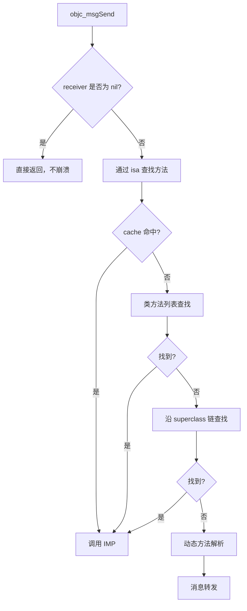

+++
date = '2026-06-28T19:13:28+08:00'
draft = true
title = '第二章：Objective-C 动态解析（Runtime）'
tags = ["Objective-C", "Runtime", "面试"]
categories = ['iOS 面试']
+++

# 第二章：Objective-C 动态解析（Runtime）

## 2.1 消息发送机制

OC 方法调用本质是 **消息发送**，编译后转为：

```objc
[obj foo];  →  objc_msgSend(obj, @selector(foo));
```

### 完整流程



---

## 2.2 动态方法解析（第一次补救）

```objc
+ (BOOL)resolveInstanceMethod:(SEL)sel;
+ (BOOL)resolveClassMethod:(SEL)sel;
```

- Runtime 询问：**要不要动态添加这个方法？**
- 常见用法： `@dynamic` 属性底层用 `class_addMethod` 补 IMP
- Core Data 的 `@dynamic` 就是典型场景

---

## 2.3 消息转发

### Fast Forwarding（第二次补救）

```objc
- (id)forwardingTargetForSelector:(SEL)aSelector;
```

- 把消息转给**另一个对象**处理（如 `NSArray` 内部 `_NSArrayI` 转发）
- 返回 nil 则进入 Normal Forwarding

### Normal Forwarding（第三次补救）

```objc
- (NSMethodSignature *)methodSignatureForSelector:(SEL)aSelector;
- (void)forwardInvocation:(NSInvocation *)anInvocation;
```

- 构造方法签名 → 包装成 `NSInvocation` → 完全自定义转发逻辑
- **NSProxy** 抽象类就是基于此实现

### 最后一步

`doesNotRecognizeSelector:` → 崩溃 `unrecognized selector sent to instance`

---

## 2.4 关联知识点汇总

| 技术点 | 面试要点 |
|--------|----------|
| **Runtime API** | `class_addMethod`、`method_exchangeImplementations`、`class_getInstanceMethod` |
| **Associated Objects** | Category 不能加 ivar，用 `objc_setAssociatedObject` 模拟"属性" |
| **KVC** | `setValue:forKey:` 触发 `_xxx` setter 或直接 `_ivar` 赋值；找不到 key 走 `_defaultKVC` |
| **KVO** | isa swizzling + 重写 setter + 依赖 `willChangeValueForKey:` / `didChangeValueForKey:` |
| **@dynamic vs @synthesize** | dynamic 交给 Runtime/子类实现；synthesize 自动生成 getter/setter 和 ivar |
| **消息转发 vs 多态** | OC 多态靠 Runtime 动态绑定，C++ 虚函数表是编译期 |
