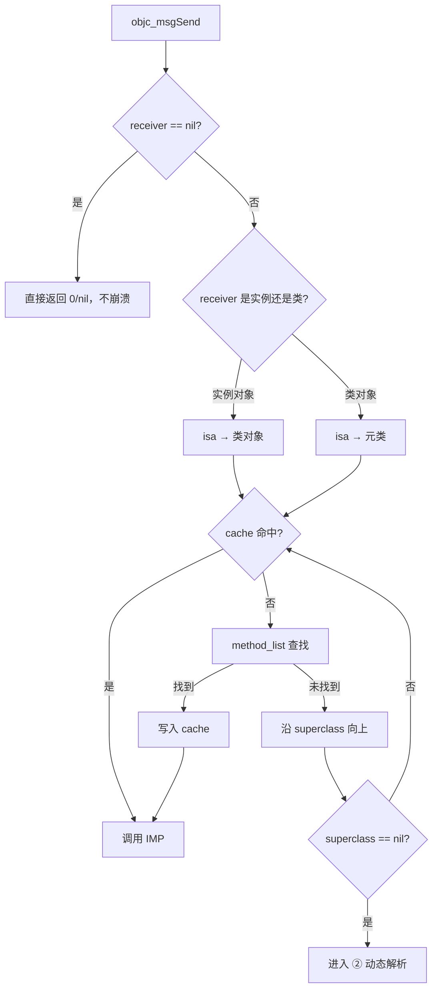

+++
date = '2026-06-28T19:13:28+08:00'
draft = true
weight = 2
title = '第二章：Objective-C 动态解析（Runtime）'
tags = ["Objective-C", "Runtime", "面试"]
categories = ['iOS 面试']
+++

# 第二章：Objective-C 动态解析（Runtime）

> OC 方法调用 = **发消息**。完整链路分 **三大阶段**：消息发送 → 动态解析 → 消息转发。

```
[obj method]
    │
    ▼
┌─────────────────────────────────────┐
│  ① 消息发送（Method Lookup）         │  cache → method_list → superclass
│     找到 IMP → 直接调用 ✅           │
└─────────────────────────────────────┘
    │ 全链未找到
    ▼
┌─────────────────────────────────────┐
│  ② 动态解析（Dynamic Resolution）    │  resolveInstanceMethod:
│     动态添加方法 → 重新走 ① ✅       │
└─────────────────────────────────────┘
    │ 返回 NO / 仍未找到
    ▼
┌─────────────────────────────────────┐
│  ③ 消息转发（Message Forwarding）    │  Fast → Normal → 崩溃
└─────────────────────────────────────┘
```

---

## 2.1 消息发送（Method Lookup）


> 虚线 = **isa**；实线 = **superclass**。实例方法沿 **类链** 查，类方法沿 **元类链** 查。

### 本质

OC 方法调用本质是 **消息发送**，编译后转为：

```objc
[obj foo];  →  objc_msgSend(obj, @selector(foo));
```

**不是**编译期绑死函数地址，而是运行时把 `(receiver, selector)` 交给 Runtime **查找 IMP 并调用**。

### 查找流程


```mermaid
flowchart TD
    A["objc_msgSend"] --> B{"receiver == nil?"}
    B -->|是| C["直接返回 0/nil，不崩溃"]
    B -->|否| D{"receiver 是实例还是类?"}
    D -->|实例对象| E["isa → 类对象"]
    D -->|类对象| F["isa → 元类"]
    E --> G{"cache 命中?"}
    F --> G
    G -->|是| H["调用 IMP"]
    G -->|否| I["method_list 查找"]
    I -->|找到| J["写入 cache"]
    J --> H
    I -->|未找到| K["沿 superclass 向上"]
    K --> L{"superclass == nil?"}
    L -->|否| G
    L -->|是| M["进入 ② 动态解析"]
```

### 逐步说明

| 步骤 | 做什么 | 要点 |
|------|--------|------|
| **1. nil 检查** | receiver 为 nil | 直接返回，**不崩溃**（0 / nil / NO） |
| **2. 定起点** | 读 `isa` | 实例方法 → **类**；类方法 → **元类** |
| **3. cache** | 查方法缓存 | 命中则 **O(1)** 调 IMP；上次慢查结果会写入 cache |
| **4. method_list** | 查当前类方法列表 | `method_t { SEL, types, IMP }` |
| **5. superclass** | 沿父类 / 父元类链向上 | 重复 3～4，直到链尽头 |
| **6. 仍未找到** | — | 进入 **② 动态解析**（不是继续在 superclass 里转发） |

### 实例方法 vs 类方法

| 调用 | 起点 | 沿什么链向上 |
|------|------|--------------|
| `[person eat]` | `person.isa` → Person **类** | 类的 **superclass** |
| `[Person run]` | `Person.isa` → Person **元类** | 元类的 **superclass** |

详见 [第一章 isa 与方法查找](/posts/%E7%AC%AC%E4%B8%80%E7%AB%A0isa-%E4%B8%8E-superclass.html)。

### 本阶段结束条件

- ✅ **找到 IMP** → 调用，流程结束
- ❌ **整条 superclass 链都没有** → 进入 **② 动态解析**

---

## 2.2 动态解析（Dynamic Resolution）

> **第一次补救**：Runtime 问对象——「要不要 **现加一个** 这个方法？」

### 入口方法

```objc
+ (BOOL)resolveInstanceMethod:(SEL)sel;   // 实例方法
+ (BOOL)resolveClassMethod:(SEL)sel;     // 类方法
```

### 流程

```
① 消息发送未找到 IMP
    │
    ▼
② 调用 resolveInstanceMethod: / resolveClassMethod:
    │
    ├─ 返回 YES → 通常内部 class_addMethod 动态添加 IMP
    │              → 重新走 ① 消息发送 → 找到 → 调用 ✅
    │
    └─ 返回 NO → 进入 ③ 消息转发
```

### 典型用法

```objc
+ (BOOL)resolveInstanceMethod:(SEL)sel {
    if (sel == @selector(dynamicMethod)) {
        class_addMethod(self, sel, (IMP)dynamicIMP, "v@:");
        return YES;
    }
    return [super resolveInstanceMethod:sel];
}
```

| 场景 | 说明 |
|------|------|
| **@dynamic 属性** | 声明后不自动生成实现，Runtime/子类/Core Data 动态补方法 |
| **Core Data** | `@dynamic` 属性由框架在运行时提供 accessor |
| **按需添加方法** | 懒加载、插件化注册 IMP |

### 与消息转发的区别

| | 动态解析 | 消息转发 |
|--|----------|----------|
| 目的 | **添加**缺失的方法 | 把消息 **转给别的对象** 或自定义处理 |
| 典型 API | `class_addMethod` | `forwardingTargetForSelector:` 等 |
| 顺序 | **先于**转发 | 解析失败后 |

---

## 2.3 消息转发（Message Forwarding）

> **第二、三次补救**：不添加方法，而是 **换对象处理** 或 **完全自定义**。

### 总流程

```
resolve... 返回 NO
    │
    ▼
Fast Forwarding（第二次补救）
    forwardingTargetForSelector:
    │
    ├─ 返回非 nil 对象 → 该对象重新接收消息 ✅
    │
    └─ 返回 nil
         │
         ▼
Normal Forwarding（第三次补救）
    methodSignatureForSelector:
         │
         ├─ 返回 nil → doesNotRecognizeSelector: → 💥 崩溃
         │
         └─ 返回 NSMethodSignature
              → forwardInvocation:（自定义逻辑）✅
```

### Fast Forwarding — `forwardingTargetForSelector:`

```objc
- (id)forwardingTargetForSelector:(SEL)aSelector {
    if (aSelector == @selector(missingMethod)) {
        return self.backupObject;  // 转给另一个对象
    }
    return [super forwardingTargetForSelector:aSelector];
}
```

- 把消息转给 **另一个对象** 处理
- 典型：`NSArray` 内部 `_NSArrayI` 把未实现方法转给内部实现类
- 返回 nil → 进入 Normal Forwarding

### Normal Forwarding

**第一步**：提供方法签名（Runtime 需要知道参数/返回值类型）

```objc
- (NSMethodSignature *)methodSignatureForSelector:(SEL)aSelector;
```

**第二步**：完全自定义转发

```objc
- (void)forwardInvocation:(NSInvocation *)anInvocation;
```

- Runtime 根据签名构造 `NSInvocation`，包装参数
- 可在 `forwardInvocation:` 里 **改 target、改 selector、多次转发**
- **NSProxy** 抽象类基于此实现

### 最后一步：崩溃

```objc
- (void)doesNotRecognizeSelector:(SEL)aSelector;
```

- 默认实现 → `unrecognized selector sent to instance` 💥
- 一般不重写，除非调试

### 三步补救对照表（必背）

| 阶段 | 方法 | 作用 |
|------|------|------|
| ② 动态解析 | `resolveInstanceMethod:` / `resolveClassMethod:` | 动态 **添加** 方法 |
| ③ Fast | `forwardingTargetForSelector:` | 转给 **另一个对象** |
| ③ Normal | `methodSignatureForSelector:` + `forwardInvocation:` | **自定义** 转发逻辑 |

---

## 2.4 完整串联（面试口述版）

```
[obj foo]

1. 消息发送
   objc_msgSend → nil 检查 → isa → cache → method_list → superclass 链
   找到 IMP → 调用，结束

2. 动态解析（未找到时）
   resolveInstanceMethod:
   → class_addMethod 补 IMP → 重新查找 → 调用，结束

3. 消息转发（resolve 返回 NO）
   forwardingTargetForSelector: → 有对象则转给它
   → methodSignatureForSelector: + forwardInvocation:
   → 仍无法处理 → doesNotRecognizeSelector: 崩溃
```

---

## 2.5 关联知识点

| 技术点 | 面试要点 |
|--------|----------|
| **Runtime API** | `class_addMethod`、`method_exchangeImplementations`、`class_getInstanceMethod` |
| **Associated Objects** | Category 不能加 ivar，用 `objc_setAssociatedObject` 模拟属性 |
| **KVO** | 动态子类 + isa swizzling + 重写 setter |
| **Method Swizzling** | 交换 method_list 中的 IMP，改的是 **类** 的方法列表 |
| **@dynamic vs @synthesize** | dynamic 交给 Runtime/子类；synthesize 自动生成 getter/setter + ivar |
| **vs C++ 虚表** | OC 默认消息机制 + 运行时查找；C++ 虚函数表编译期确定 |

---

## 2.6 高频面试 Q&A

### Q1：`objc_msgSend` 之前做了什么？

编译期：`[obj foo]` → `objc_msgSend(obj, @selector(foo))`。  
运行时：从 **nil 检查** 开始，进入 **① 消息发送**。

### Q2：动态解析和消息转发能跳过消息发送吗？

不能。必须先 **① 查不到**，才 **② 解析**，再 **③ 转发**。找到 IMP 后不会走后面阶段。

### Q3：类方法和实例方法的 resolve 区别？

- 实例方法 → `resolveInstanceMethod:`
- 类方法 → `resolveClassMethod:`（注意 metaclass）

### Q4：综合题入口

详见 [第九章 Q1](/posts/%E7%AC%AC%E4%B9%9D%E7%AB%A0%E7%BB%BC%E5%90%88%E4%B8%B2%E8%81%94%E9%A2%98%E9%AB%98%E9%A2%91.html)。
