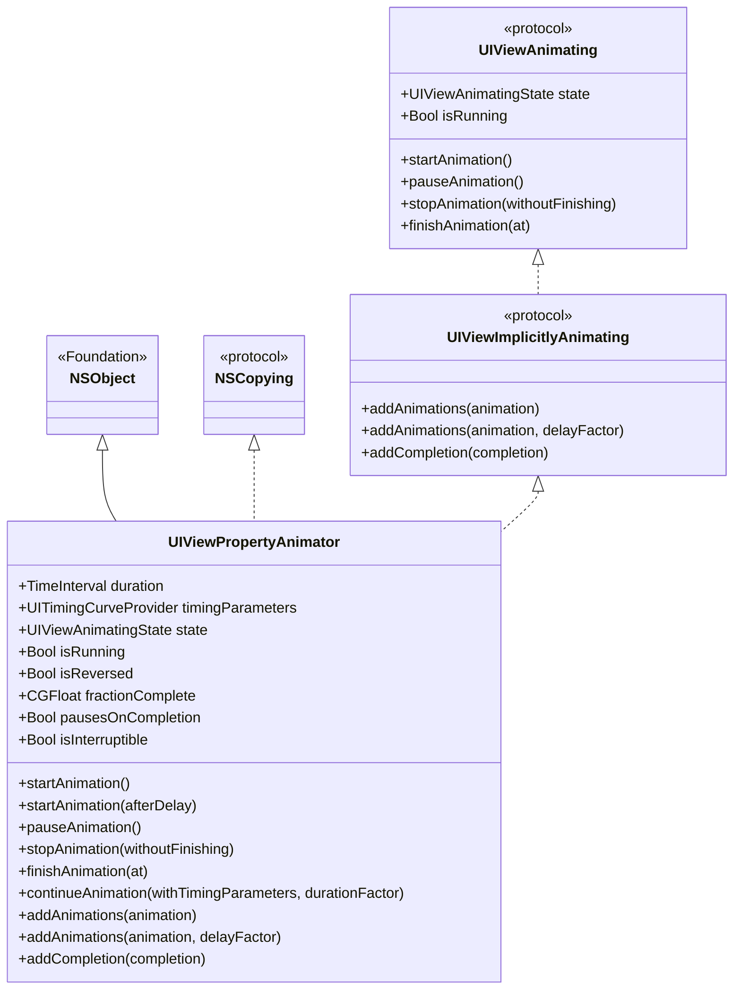

+++
date = '2025-12-24T16:23:06+08:00'
draft = false
title = 'UIViewPropertyAnimator使用指南'
tags = ["iOS", "UIKit", "UIViewPropertyAnimator"]
categories = ["iOS"]
cover = "https://images.unsplash.com/photo-1766109020990-367125084c35?q=80&w=1742&auto=format&fit=crop&ixlib=rb-4.1.0&ixid=M3wxMjA3fDB8MHxwaG90by1wYWdlfHx8fGVufDB8fHx8fA%3D%3D"
+++

## 类继承关系与协议结构

### 继承关系与协议遵循图



### 类图说明

- **NSObject**：Foundation 框架的基类，所有 Objective-C 类的根类
- **UIViewPropertyAnimator**：继承自 NSObject，遵循 `UIViewAnimating` 和 `UIViewImplicitlyAnimating` 协议
- **UIViewAnimating**：协议，定义了动画控制的核心接口（状态管理、启动、暂停、停止）
- **UIViewImplicitlyAnimating**：协议，定义了添加动画块和完成回调的接口

**参考文档**：[UIViewPropertyAnimator - Apple Developer Documentation](https://developer.apple.com/documentation/uikit/uiviewpropertyanimator?language=objc)

### 协议详细说明

#### UIViewAnimating 协议

`UIViewPropertyAnimator` 遵循 `UIViewAnimating` 协议，该协议定义了动画控制的核心接口：

| 属性/方法                     | 说明                     |
| ----------------------------- | ------------------------ |
| `state: UIViewAnimatingState` | 动画的当前状态（只读）   |
| `isRunning: Bool`             | 动画是否正在运行（只读） |
| `startAnimation()`            | 开始或恢复动画           |
| `pauseAnimation()`            | 暂停动画                 |
| `stopAnimation(_:)`           | 停止动画                 |
| `finishAnimation(at:)`        | 完成动画到指定位置       |

---

## 基本使用

### 1. 创建 Animator

#### 方式一：使用预设曲线

```swift
let animator = UIViewPropertyAnimator(
    duration: 1.0,
    curve: .easeInOut,
    animations: {
        view.alpha = 0.5
        view.transform = CGAffineTransform(scaleX: 1.5, y: 1.5)
    }
)
```

#### 方式二：使用自定义时间参数

```swift
let timing = UICubicTimingParameters(animationCurve: .easeInOut)
let animator = UIViewPropertyAnimator(
    duration: 1.0,
    timingParameters: timing,
    animations: {
        view.center = CGPoint(x: 200, y: 200)
    }
)
```

#### 方式三：使用 Spring 动画

```swift
let spring = UISpringTimingParameters(
    dampingRatio: 0.6,
    initialVelocity: CGVector(dx: 0, dy: 0)
)
let animator = UIViewPropertyAnimator(
    duration: 0,
    timingParameters: spring,
    animations: {
        view.frame = newFrame
    }
)
```

### 2. 启动动画

```swift
// 立即启动
animator.startAnimation()

// 延迟启动
animator.startAnimation(afterDelay: 0.5)
```

### 3. 添加完成回调

```swift
animator.addCompletion { position in
    switch position {
    case .end:
        print("动画到达结束位置")
    case .start:
        print("动画到达开始位置")
    case .current:
        print("动画在当前位置停止")
    @unknown default:
        break
    }
}
```

---

## 状态管理

### UIViewAnimatingState 枚举

```swift
enum UIViewAnimatingState: Int {
    case inactive = 0  // 未激活状态（初始状态或已完成）
    case active = 1    // 激活状态（运行中或已暂停）
    case stopped = 2   // 已停止状态（调用了 stopAnimation）
}
```

### 状态转换图

```
[inactive] 
    │
    │ startAnimation()
    ▼
[active - running]
    │
    │ pauseAnimation()
    ▼
[active - paused]
    │
    │ startAnimation() / continueAnimation()
    ▼
[active - running]
    │
    │ stopAnimation(true) / 动画完成
    ▼
[inactive]
    │
    │ stopAnimation(false)
    ▼
[stopped]
    │
    │ finishAnimation(at:)
    ▼
[inactive]
```

### 状态检查示例

```swift
if animator.state == .active {
    if animator.isRunning {
        print("动画正在运行")
    } else {
        print("动画已暂停")
    }
} else if animator.state == .inactive {
    print("动画未激活")
} else if animator.state == .stopped {
    print("动画已停止，需要调用 finishAnimation")
}
```

---

## 核心方法详解

### 1. startAnimation()

**功能**：开始或恢复动画

**使用场景**：

- 首次启动动画
- 手动暂停后恢复动画

**示例**：

```swift
// 立即启动
animator.startAnimation()

// 延迟启动
animator.startAnimation(afterDelay: 2.0)
```

**注意事项**：

- 调用后系统会持有 animator 的引用，即使局部变量离开作用域，动画仍会继续执行
- 对于已暂停的动画，会从暂停位置立即继续

### 2. pauseAnimation()

**功能**：暂停正在运行的动画

**使用场景**：

- 用户交互需要暂停动画
- 需要精确控制动画进度

**示例**：

```swift
if animator.state == .active && animator.isRunning {
    animator.pauseAnimation()
    print("当前进度: \(animator.fractionComplete)")
}
```

**注意事项**：

- 只能在 `state == .active` 且 `isRunning == true` 时调用
- 暂停后可以通过 `fractionComplete` 查看当前进度

### 3. stopAnimation(_ withoutFinishing: Bool)

**功能**：停止动画

**参数说明**：

- `withoutFinishing: true`：立即停止，不执行完成回调，状态变为 `inactive`
- `withoutFinishing: false`：停止动画，状态变为 `stopped`，需要调用 `finishAnimation(at:)` 完成

**示例**：

```swift
// 方式1：立即停止，不执行完成回调
animator.stopAnimation(true)

// 方式2：停止后手动完成
animator.stopAnimation(false)
animator.finishAnimation(at: .current)  // 停在当前位置
// 或
animator.finishAnimation(at: .end)      // 跳到结束位置
```

### 4. continueAnimation(withTimingParameters:durationFactor:)

**功能**：在系统中断后恢复动画，可以调整动画参数

**使用场景**：

- 应用从后台回到前台时恢复动画
- 需要改变动画速度或时间曲线后继续

**参数说明**：

- `timingParameters: UITimingCurveProvider?`：新的时间参数，`nil` 表示保持原参数
- `durationFactor: CGFloat`：时间因子
  - `1.0`：保持原速度
  - `0.5`：加速 2 倍完成剩余部分
  - `2.0`：减速一半完成剩余部分

**示例**：

```swift
// 保持原参数继续
animator.continueAnimation(withTimingParameters: nil, durationFactor: 1.0)

// 加速完成剩余动画
animator.continueAnimation(withTimingParameters: nil, durationFactor: 0.5)

// 改变动画曲线后继续
let newTiming = UICubicTimingParameters(animationCurve: .easeOut)
animator.continueAnimation(withTimingParameters: newTiming, durationFactor: 1.0)
```

**与 startAnimation() 的区别**：

- `startAnimation()`：用于手动暂停后的恢复，立即继续，无延迟
- `continueAnimation()`：用于系统中断后的恢复，可以调整参数

### 5. addAnimations(_:delayFactor:)

**功能**：动态添加动画块

**参数说明**：

- `animation`：要执行的动画块
- `delayFactor`：延迟因子（0.0-1.0），相对于总时长的延迟比例

**示例**：

```swift
animator.addAnimations {
    view.backgroundColor = .red
}

// 在动画进行到 50% 时执行
animator.addAnimations({
    view.alpha = 0.0
}, delayFactor: 0.5)
```

### 6. fractionComplete

**功能**：获取或设置动画的完成进度

**取值范围**：`0.0` 到 `1.0`

**使用场景**：

- 查看动画当前进度
- 手动控制动画进度（需要先暂停）

**示例**：

```swift
// 查看进度
let progress = animator.fractionComplete

// 手动设置进度（需要先暂停）
animator.pauseAnimation()
animator.fractionComplete = 0.5  // 跳到 50% 的位置
```

---

## 注意事项

### ⚠️ 内存管理

1. **局部变量的生命周期**

   - 如果 animator 是局部变量，但调用了 `startAnimation()`，系统会持有引用
   - 动画会正常执行，不会因为局部变量离开作用域而停止
   - 建议使用实例变量或属性来持有 animator 的引用

2. **循环引用**

   - 在 `addCompletion` 中使用 `[weak self]` 避免循环引用

   ```swift
   animator.addCompletion { [weak self] position in
       guard let self = self else { return }
       // 处理完成逻辑
   }
   ```

3. **清理资源**

   - 在 `deinit` 中停止并清理 animator

   ```swift
   deinit {
       animator?.stopAnimation(true)
       animator = nil
   }
   ```

### ⚠️ 状态检查

1. **调用方法前检查状态**

   ```swift
   // ❌ 错误：不检查状态直接调用
   animator.pauseAnimation()
   
   // ✅ 正确：先检查状态
   if animator.state == .active && animator.isRunning {
       animator.pauseAnimation()
   }
   ```

2. **continueAnimation 的使用条件**

   - 只能在 `state == .active` 且动画已暂停时调用
   - 主要用于系统中断后的恢复，手动暂停后建议使用 `startAnimation()`

### ⚠️ 系统中断处理

1. **应用进入后台**
   - 系统会自动暂停所有动画
   - 不需要手动调用 `pauseAnimation()`

2. **应用回到前台**
   - 使用 `continueAnimation()` 恢复动画
   - 可以调整动画参数以适应新的场景

**示例**：

```swift
// 监听应用生命周期
NotificationCenter.default.addObserver(
    self,
    selector: #selector(applicationWillEnterForeground),
    name: UIApplication.willEnterForegroundNotification,
    object: nil
)

@objc private func applicationWillEnterForeground() {
    if let animator, animator.state == .active {
        animator.continueAnimation(withTimingParameters: nil, durationFactor: 1.0)
    }
}
```

### ⚠️ stopAnimation 的正确使用

1. **两种停止方式**

   ```swift
   // 方式1：立即停止，不执行完成回调
   animator.stopAnimation(true)
   // 状态变为 inactive，可以直接创建新的 animator
   
   // 方式2：停止后手动完成
   animator.stopAnimation(false)
   // 状态变为 stopped，必须调用 finishAnimation
   animator.finishAnimation(at: .current)  // 或 .end
   ```

2. **常见错误**

   ```swift
   // ❌ 错误：调用 stopAnimation(false) 后忘记调用 finishAnimation
   animator.stopAnimation(false)
   // 此时 animator.state == .stopped，无法继续使用
   
   // ✅ 正确：调用 stopAnimation(false) 后必须调用 finishAnimation
   animator.stopAnimation(false)
   animator.finishAnimation(at: .current)
   ```

### ⚠️ 动画完成位置

`UIViewAnimatingPosition` 枚举值：

- `.end` (rawValue: 0)：动画到达结束位置（正向播放完成）
- `.start` (rawValue: 1)：动画到达开始位置（反向播放完成）
- `.current` (rawValue: 2)：动画在当前位置停止

**注意**：在完成回调中处理所有情况，包括 `@unknown default`

### ⚠️ 可中断性

1. **isInterruptible 属性**
   - 设置为 `true` 允许动画被系统中断（如用户交互）
   - 默认值取决于创建方式

2. **isUserInteractionEnabled**
   - 动画期间可能需要禁用用户交互
   - 根据具体需求设置

### ⚠️ 多次调用 startAnimation

- 如果 animator 已经启动，再次调用 `startAnimation()` 不会重新开始动画
- 对于已暂停的动画，会从暂停位置继续
- 如果需要重新开始，应该创建新的 animator

---

## 最佳实践

### 1. 使用实例变量持有 Animator

```swift
class MyViewController: UIViewController {
    private var animator: UIViewPropertyAnimator?
    
    func startAnimation() {
        // 先停止旧的 animator
        animator?.stopAnimation(true)
        
        // 创建新的 animator
        animator = UIViewPropertyAnimator(duration: 1.0, curve: .easeInOut) {
            // 动画代码
        }
        
        animator?.addCompletion { [weak self] position in
            self?.animator = nil
        }
        
        animator?.startAnimation()
    }
}
```

### 2. 在 deinit 中清理

```swift
deinit {
    NotificationCenter.default.removeObserver(self)
    animator?.stopAnimation(true)
    animator = nil
}
```

### 3. 处理系统中断

```swift
override func viewDidLoad() {
    super.viewDidLoad()
    
    // 监听应用生命周期
    NotificationCenter.default.addObserver(
        self,
        selector: #selector(applicationWillEnterForeground),
        name: UIApplication.willEnterForegroundNotification,
        object: nil
    )
}

@objc private func applicationWillEnterForeground() {
    if let animator, animator.state == .active {
        animator.continueAnimation(withTimingParameters: nil, durationFactor: 1.0)
    }
}
```

### 4. 使用 weak self 避免循环引用

```swift
animator.addCompletion { [weak self] position in
    guard let self = self else { return }
    // 使用 self 处理完成逻辑
}
```

### 5. 状态检查后再操作

```swift
// 暂停前检查
if animator.state == .active && animator.isRunning {
    animator.pauseAnimation()
}

// 继续前检查
if animator.state == .active && !animator.isRunning {
    animator.startAnimation()
}
```

### 6. 使用 fractionComplete 实现交互式动画

```swift
@objc private func handlePan(_ gesture: UIPanGestureRecognizer) {
    switch gesture.state {
    case .began:
        animator.pauseAnimation()
    case .changed:
        let translation = gesture.translation(in: view)
        let progress = translation.x / view.bounds.width
        animator.fractionComplete = max(0, min(1, progress))
    case .ended:
        let velocity = gesture.velocity(in: view)
        if velocity.x > 0 {
            animator.startAnimation()
        } else {
            animator.isReversed = true
            animator.startAnimation()
        }
    default:
        break
    }
}
```

---

## 总结

`UIViewPropertyAnimator` 是 iOS 10+ 引入的强大动画 API，提供了：

- ✅ 可中断、可暂停、可恢复的动画控制
- ✅ 灵活的状态管理
- ✅ 系统中断自动处理
- ✅ 交互式动画支持
- ✅ 动态添加动画块

**关键要点**：

1. 使用实例变量持有 animator 引用
2. 在 deinit 中清理资源
3. 调用方法前检查状态
4. 使用 weak self 避免循环引用
5. 正确处理系统中断场景
6. 理解 `stopAnimation` 的两种使用方式

